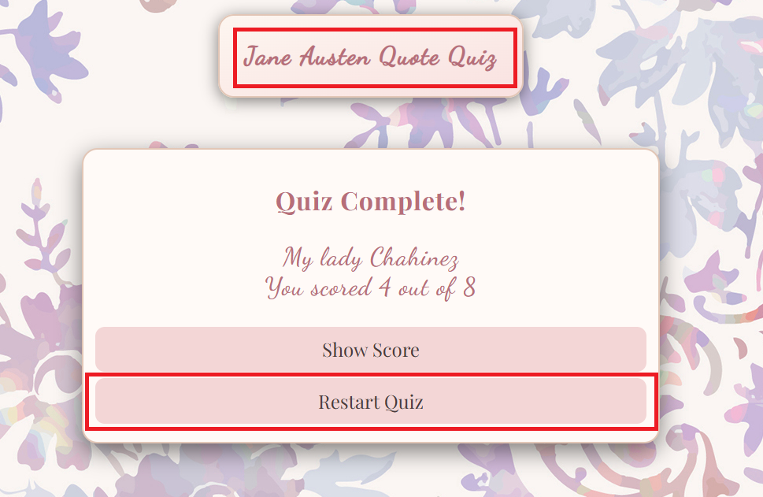
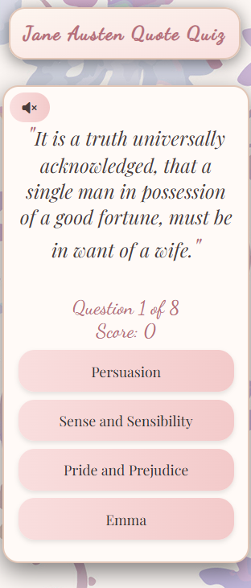
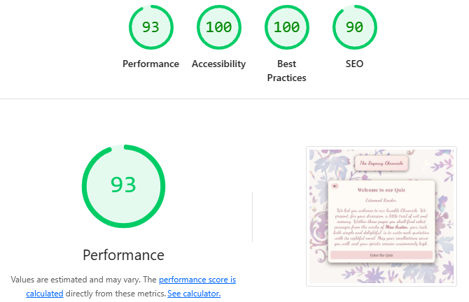
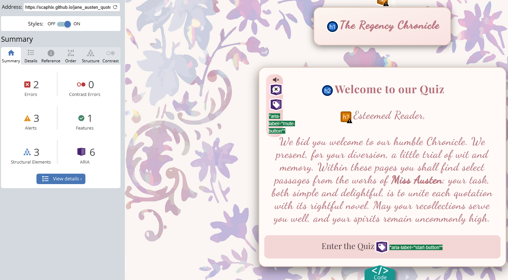
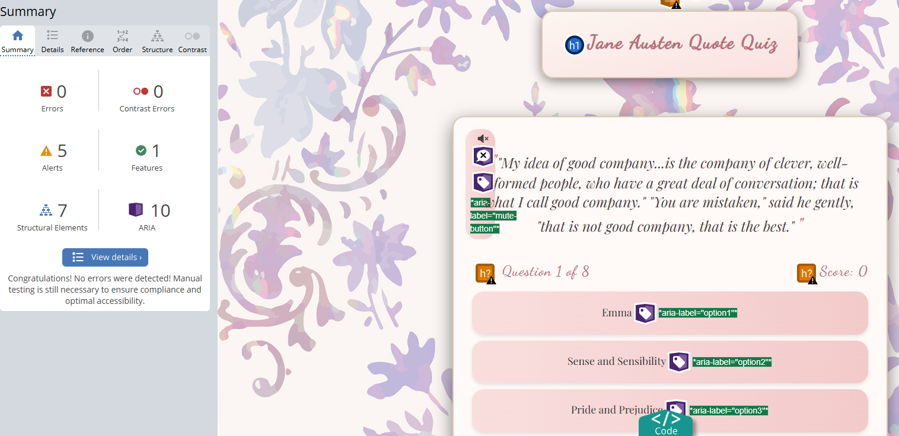

# Manual Testing

| Feature     | Expect        | Result |
| :---------: | :----------: | :-----:|
| **Intro music**  | When the page loads, the music is off   | ✔|
| **Mute button**  | When I click on the mute button on the start screen, I can turn on/off the music | ✔ | 
| **Enter Quiz button**  | When I click on the Enter Quiz button I enter the name screen  | ✔ | 
| **Mute button**   | When I click on the mute button of the name screen, I can turn on/off the music | ✔ | 
| **Select player title**   | When I click on the select button a title selection drops down | ✔ | 
| **Name input**   | When I click on the input name field I can write my name  | ✔ | 
| **Input error**   | If the player title or the name is not filled out, an error message appears | ✔ |
| **Let's begin button**   | When I click on the Let us begin button, I enter the quiz screen| ✔ | 
|**Mute button**   | When I click on the mute button of the Quiz screen, I can turn on/off the sound effects | ✔ | 
| **Options hover**  |While hovering over the options, I receive visual feedback   | ✔|
| **Secondary Title**  | When I click on the Title on the quiz screen, I navigate to the start page  | ✔|
| **Option buttons** | When I click on an option, I have a visual response whether it's correct or wrong and a new question loads  | ✔ |
| **Score tracker** | When I click on the right answer, the score updates  | ✔ |
| **Progress tracker** | When I click on an option the questions tracker is incremented |  ✔ |
| **Score screen** | When I click on the last question the score screen appears with my score displayed | ✔ |
| **Show score button** | When I click on the show score button, the High scores screen appears and my score is displayed on the table | ✔ |
| **Restart quiz** | When I click on the restart quiz button I go back to the quiz screen and I can take the quiz again.  | ✔ |
| **High score table** | The high scores are sorted from higher to lower | ✔ |
| **Back to start button** | When I click on the back to start button, I return to the start screen | ✔ |
| **Restart quiz** | When I click on the restart quiz button on the high scores screen I go back to the quiz screen and I can take the quiz again.  | ✔ |
| **Clear scores** | When I click on the clear scores button, the scores are deleted and the table is empty | ✔ |

# Testing User Stories

| Feature  | Implementation  |
| --------------------------------- | :------------------------------:|
| As a new visitor, I want to understand what the quiz offers, so I can decide if it's right for me. |  |
| As a user, I want to easily start the quiz, so I can begin testing my Austen knowledge immediately. |  |
| As a user, I want to see my score and progress, so I can track my performance throughout the quiz. |  |
| As a user, I want to be able to restart the quiz, so I can play multiple times and improve my score. |    |
| As a mobile user, I want a responsive layout, so my experience is smooth on any device. |  |
| As a user, I want to enter my name and title, so the quiz feels personalized and engaging.|  |
| As a user, I want sound effects for correct and incorrect answers, so the experience is more immersive.|  |
| As a visitor, I want to see a high score table, so I can compete with other players. |  |

# Validators

## [W3C html validator](https://validator.w3.org/nu/#textarea)

### Home page

No error found on this page. The info tag is generated by the Prettier extension

### Quiz page

No error found on this page. The info tag is generated by the Prettier extension

### Error page

No error found on this page. The info tag is generated by the Prettier extension

## [W3C css validator](https://jigsaw.w3.org/css-validator/validator)

No error found.

## [Java script validator](https://jshint.com/)

### Home page

### Quiz page

The validator shows one undefined variable, which is quizData. This variable is defined and called from another file named questions.js located in the Data document.

# lighthouse testing

## Home page

**Desktop**

## Quiz page

**Desktop**

## Error page

**Desktop**

## Accessibility Evaluation

### home page

[Web accessibility evaluator](https://wave.webaim.org/report#/https://scaphix.github.io/jane_austen_quote_quiz/index.html)

### Quiz page

[Web accessibility evaluator](https://wave.webaim.org/report#/https://scaphix.github.io/jane_austen_quote_quiz/quiz.html)

### Error page

[Web accessibility evaluator](https://wave.webaim.org/report#/https://scaphix.github.io/jane_austen_quote_quiz/hjh)

